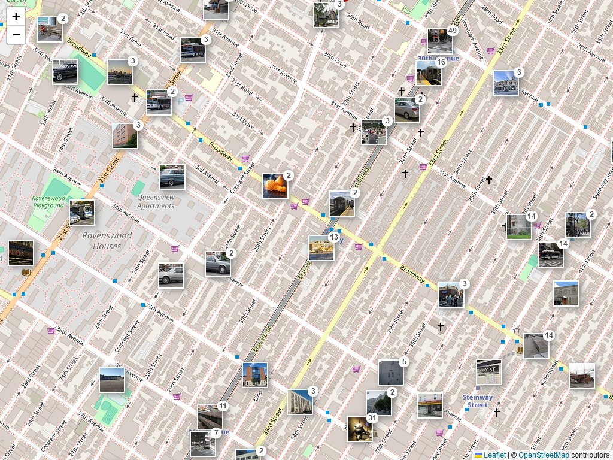

# Leaflet.CommonsPhotos

Simple plugin to show geotagged Wikimedia Commons photos on a Leaflet map.

## Requirements
* [Leaflet.Photo](https://github.com/turban/Leaflet.Photo/)
* [Leaflet.markercluster](https://github.com/Leaflet/Leaflet.markercluster/)

## Usage
See Demo's [index.html](demo/index.html)

## Online Demo
* https://59de44955ebd.github.io/leaflet.commons/

## Screenshot

